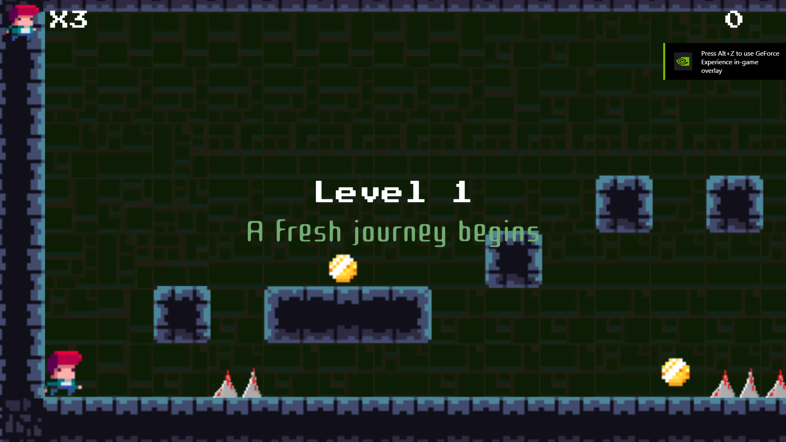
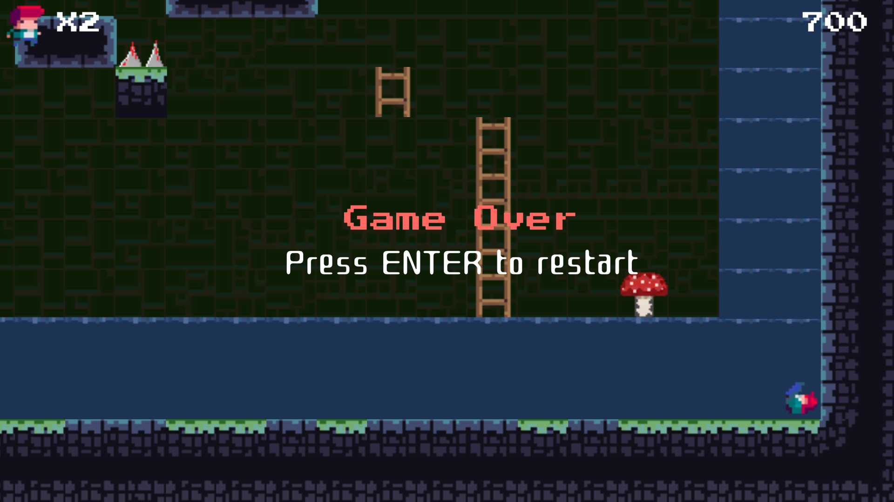

<!-- GAME PROJECT TITLE -->
# TileVania---Game
Game created for study purposes by Matheus Soares Martins, in this game you control a character across a 2D plataform game. 
It have different cameras for different states (idle, running and climbing), and they swap between each other nicely. 
 
You can run, jump and climb ladders in this game to cross the platforms until you reach the level exit. (A icon of a exit door) 
You need to know how to jump properly, and do parkour between the ladders to reach your goal while avoiding the hazards of the game.
(Water, Spikes, and Bastion Enemies)
 

This game was made to be played by one player, and its difficulty escalates the more levels you have completed.
 

Game Controls 
- Player controls: 
Up Arrow or W - Climb up when in a ladder. 
Left Arrow or A - Runs to the left. 
Right Arrow or D - Runs to the right. 
Down Arrow or S - Climb down when in a ladder. 
Space - Makes the character jump 
Left Click - Fire a projection of the player to kill enemies (Bastions) 
ENTER - When in game over screen allows you to try again the level. 

- Other controls: 
Esc - Closes the game. 
F11 - Toggle between fullscreen and windowed mode. 
******************************************************************************

 

<!-- GAME PROJECT IMAGES -->
# Screenshots

<!-- GAME PROJECT BUILDS -->
# Game download 
## Windows: https://mega.nz/folder/MNMnhLxZ#waDWlSSy2CT5SZEwyswU0g
## Mac: https://mega.nz/folder/AAFmyLIK#6S2H-MayzooeDc9YdPUfhg
## Linux:  https://mega.nz/folder/JN1RVIJZ#XjLX2kP-xm3ZbescZtpt2g